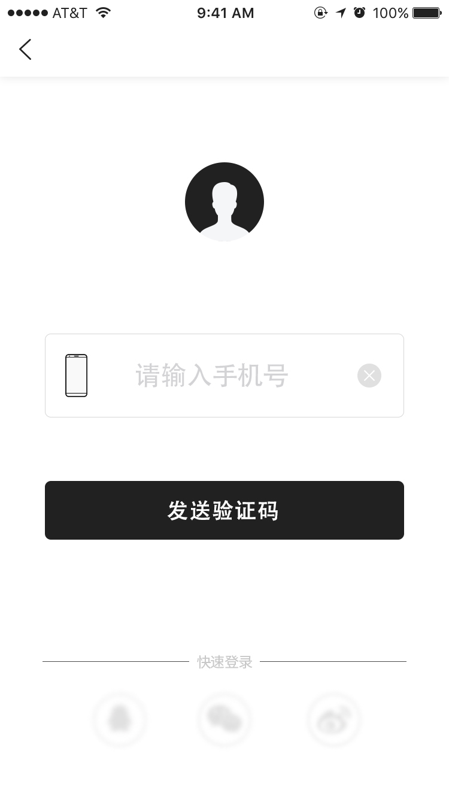
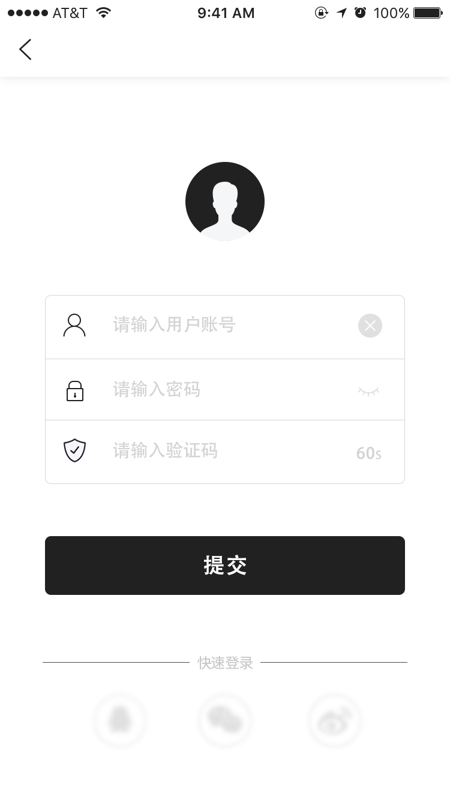
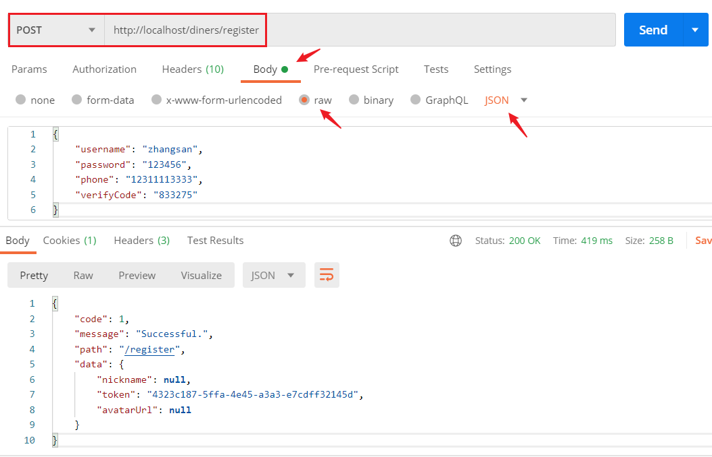

# 食客注册API接口

## 需求介绍





## 验证码保存至Redis

将短信验证码以字符串保存到Redis，同时设置过期时间，确保跟需求一致，利用Redis不仅按需保存带有过期的验证码，而且还是进程级别的共享数据，能够保证在多个Diner微服务中读取。


## 测试

先访问：http://localhost/diners/checkPhone?phone=12311113333

返回结果：

```shell
{
    "code": 0,
    "message": "该手机号未注册",
    "path": "/checkPhone",
    "data": null
}
```

再访问：http://localhost/diners/send?phone=12311113333

返回结果（Redis 查看验证码）：

```shell
{
    "code": 1,
    "message": "Successful.",
    "path": "发送成功",
    "data": "/send"
}
```

再访问：http://localhost/diners/register

请求参数：

```shell
{
    "username": "zhangsan",
    "password": "123456",
    "phone": "12311113333",
    "verifyCode": "833275"
}
```

返回结果：

```shell
{
    "code": 1,
    "message": "Successful.",
    "path": "/register",
    "data": {
        "nickname": null,
        "token": "4323c187-5ffa-4e45-a3a3-e7cdff32145d",
        "avatarUrl": null
    }
}
```



最后查看数据。


