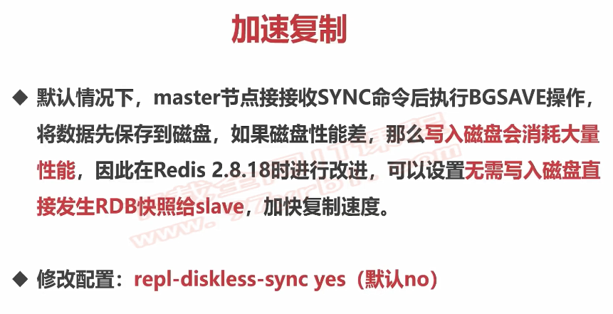
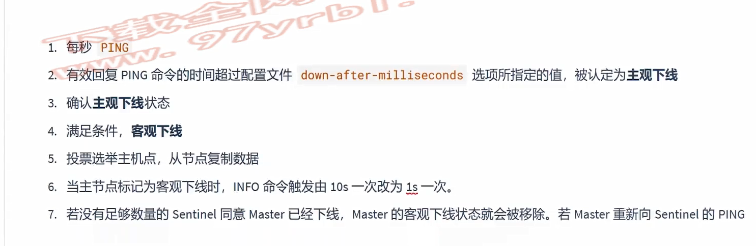

# redisfood项目中遇到问题的总结理解

## 1、关于为何不加锁就会出现线程不安全的问题

~~~java
public class RedisLockTest {
    private int count = 0;
    private void call(Jedis jedis) {
        for (int i = 0; i < 500; i++) {
            //线程到达A
            count++;
        }
    }
    public static void main(String[] args) throws Exception {
        Thread t1 = new Thread(() -> redisLockTest.call(jedisPool.getResource()));
        Thread t2 = new Thread(() -> redisLockTest.call(jedisPool.getResource()));
        t1.start();
        t2.start();
        t1.join();
        t2.join();
        System.out.println(redisLockTest.count);
    }
}
for (int i = 0; i < 500; i++) {
    count++;
}
~~~

~~~markdown
这段代码被两个线程调用，功能就是为了给count做加一，没个线程运行500次，也就是做500次加法，正常应该是1000，但是实际却不是，因为这涉及到jmm内存模型。
我来解释一下,这里只做粗略解释，后面juc的时候详细说。
两个线程各自有自己的临时内存，我们比如两个线程一起到达A处，此时他们两个读取的count都是0，此时第一个线程往下走，各种加，把count加到了200，但是此时还没写回主内存，只是在自己的临时内存，然后他写回主存，count是200。第二个线程可能卡了一下，等他要执行他的临时内存此时存的count是0，他就从0开始加，加到100，他也写回主存，就把刚才线程1写的200，覆盖了，这样就是数据污染，然后他们这样因为并发，交替处理数据，导致最后没有达到1000，因为不同线程之间会覆盖数据，导致做无用功。线程的不可控制出现这一原因，所以需要加锁，每次执行只能有一个线程进来。谁也不会读到不同的临时数据，进来读的就是上一个线程改完的，按顺序走。
~~~
 GEO存储地理位置底层是zset，他把score存成了52位的经纬度
 有人问了，经纬度是两个数字，怎么会是52位呢，他把经纬度做
 了哈希运算，形成一个52位的，为了不丢失精度，所以用了52位
 之所以取zset也是因为zset的score能保存52位。而且还能排序
集合运算，最后做经纬度运算。
最后，GEO的经纬度存储计算和真正的地球的有百分之0.5的偏差，要是
精度要求极其严格，建议考虑一下使用。

## 2、关于redis的击穿，穿透，雪崩的解决策略

### 1、击穿

击穿指的是一个热点key,面对高频大并发的访问的时候，它突然失效，就是失效时间到了，此时大量的请求全部打到数据库中，对数据库造成巨大压力，它打穿了缓存层，所以叫缓存击穿。

> 解决方式：

1、永不过期

​	**比如一个活动我们在活动开始之前，我们把这个活动涉及到的热点key全部设置为永不过期，这样就不会突然失效导致击穿。等到活动结束高峰期过去了，我们在人工去删除掉这些key，就不会一直占用内存了。**

**但是手动删除这里有个问题就是你掺杂了过多的人为干预，这样就是不好的，因为你人为可能就有失误，大量的key必然有遗漏之类的。**

2、逻辑过期

​	**为了避免上面说的人为可能有遗漏，我们可以在redis的key对应的对象中加一个过期时间的字段，我们设置好过期时间，每次返回我都判断一下这个过期时间，要是马上就过期了，我就开启一个线程，异步去重新加载一遍这个key，相当于续命一波。**

3、服务降级

​	就是服务降级的思路。

4、加上互斥锁

​	上面的现象是多个线程同时去查询数据库的这条数据，那么我们可以在第一个查询数据的请求上使用一个互斥锁来锁住它

### 2、穿透

穿透指的是一个key，其实缓存中没有，同时mysql中也没有，此时你要是大并发的去访问这个key，（比如黑客知道你这个没有就专门去干这个key）缓存没有就去数据库了，数据库没有你也没办法写回缓存，最后就两头受罪，并发高了就麻了。穿透了缓存层和数据库层，直接两边都穿了。

1、布隆：

​	就是指定黑白名单，不让这种你带有非法key的过来访问

2、空值存储：

​	就是你第一次访问到没有，不能不做处理，但是又没数据，那就在缓存里加一个空值进去，后面的访问就能再缓存拿到这个空值，不至于大量请求打到数据库。

3、互斥锁不推荐：

上面的现象是多个线程同时去查询数据库的这条数据，那么我们可以在第一个查询数据的请求上使用一个互斥锁来锁住它。没拿到锁就等待。

4、异步更新：

异步线程，没有就加载一下。

5、服务降级：

### 3、雪崩

雪崩指的是一大批的热点key，突然到期失效，最后全部请求落在数据库，就像雪崩一样，突然全面崩了。

1、随机失效时间

2、服务降级

3、互斥锁，不推荐

4、双缓存，设置两份或多份缓存，这两个不能过期时间一样，一个崩了用另一个。

## 3、关于淘汰和删除

我们知道淘汰策略有八种，但是还有三种删除策略分别是：

1、惰性删除

2、定时删除

3、主动删除

这些概念和理解在我的redis原理的文档中很详细。之前我一直有一个不理解就是，淘汰策略和删除策略的区别，他们到底都是干吗的。这里我解释一下。

~~~markdown
# 淘汰策略是选中哪些key要被删除，而删除策略是指定执行时机去删除你选中的对象。
比如，我设置为lru淘汰策略，
1、当内存满了的时候，他会走主动删除，删除你满足lru策略的所选key集合。
2、当内存没满，就是惰性删除：到期了我为了性能，主线程少一点判断，不删，等你访问我的时候，发现过期了才删。如果没访问就是一直在了，就会占用内存，redis作者想到这一点所以还有定时删除。
			或者定时删除：有一个与主线程异步的定时任务，定时去扫，发现就删。可见这几种是可以共存使用的。
~~~

## 4、持久化方面的一个总结

### 4.1、关于RDB

什么是RDB我就不说了，怎么配我也不说了。

~~~she
# 放行访问IP限制，这里全放行
bind 0.0.0.0
# 后台启动
daemonize yes
# 日志存储目录及日志文件名
logfile  "/opt/software/redis/redis-6.0.6/lwq/log/redis.log"
# RDB数据文件名
dbfilename  dump.rdb
# rdb数据文件和aof数据文件的存储目录
dir /opt/software/redis/redis-6.0.6/lwq/data
# 设置密码
requirepass 123456

# 5秒有1个key做了改动，就执行快照生成，触发一次RDB快照动作
save 5  1
~~~

> **产生触发快照的方式有以下几种**

- 手动执行bgsave命令
- 手动执行save命令
- 根据配置文件中设置的规则redis会自动执行，其实也还是bgsave命令，只不过是redis自己执行了
- 客户端发送shutdown命令，这句话是关服务的，所以系统此时不会再接入新的操作，所以它执行的是save命令，阻塞住客户端，然后关闭服务。如果不阻塞，还接入，待会关机完成了还有命令没持久化不就没了？
- 当有主从架构时候，从服务器向主节点发送sync命令来执行复制操作时，主服务器会执行bgsave操作，进而完成同步。

### 4.2、RDB的工作原理

~~~markdown
# 上面的serverCron是一个死循环，它一直监视你的执行，只要满足你配置文件中的条件，就触发。
# 在持久化的时候先是open(tempfile."w")，以写模式开启一个临时文件，最后写完了，把这个临时文件改名为正式文件dump.rdb（这个可以配置），然后覆盖原来的，因为它是快照，抓拍那一瞬间的，所以直接覆盖，前面的过时了。
~~~

### 4.3、RDB的优点

1、紧凑压缩的二进制文件

是二进制存储的，紧凑，空间压缩很密了。

2、fork子进程性能最大化

异步的，不阻塞

3、启动效率高

因为压缩了，紧凑了，所以恢复时候启动很快。

### 4.4、RDB的缺点

1、生成快照的时机问题

我们上面设置的5秒内改一次就算触发，频率颇高。一般生产就是15分钟触发多少次才来一次，要是期间宕机了，那不就没有持久化了？直接麻了。时间窗口的问题。

2、fork子进程的开销问题

子进程那个我在原理里面分析的很多了，确实开销大。

### 4.5、AOF的处理

AOF默认关闭，redis认为二进制压缩好，所以默认的是RDB。

~~~shell
# AOF持久化开启
appendonly yes
# AOF文件名称
appendfilename "appendonly.aof"
~~~

那个系统自动调度刷盘，一般就是交给操作系统了，这个时间一般是30秒一次，是操作系统决定的。

### 4.6、如何选择RDB和AOF

### 4.7、REDIS做备份数据

~~~shell
# 我解释一下上面的备份过程。
1、你先写一个脚本，用来去生成rdb文件的，按照日期生成目录来命名。但是你这个脚本不能人去手动运行，所以下面还得需要一个定时器。
2、linux默认集成cron定时器，所以你直接编写。（可以先看看开了吗。systemctl status crond）
没开可以执行systemctl start crond
3、写入定时任务内容，
其实第一句就行了，就是一分钟一次（cron表达式）
下面那么多其实可以删了，因为我是以日期来命名文件的，一分钟看不出来效果，所以我多睡了一会，几分钟一次，这个意思，实际开发没必要，直接配好一小时一次，或者几小时一次就好。
~~~

### 4.8、redis的优化方案

## 5、主从模式

基本的都在原理里面的。

当数据复制延迟较大：就是从的索引追不上主的索引，而且差的有点多。

可以先通知用户我们正在同步，代码切换至主节点读取，

也可以配置为No,这样就在同步的时候就返回告诉他去找主节点。

每个实例启动都有一个runid，这个id是标识，当你主节点故障了，重启之后id就变了，此时从节点发现id变了，

他就以为换主了，就要来一次全量同步的。当然2.8之后可以增量了。

选举slave为主，因为从上面有主数据，你直接选从为主，就不用复制了。

## 6、哨兵

Redis Sentinel机制是特殊的redis节点，只是它不存储数据。

哨兵具有以下几个特点：

1、监控

2、提醒

3、自动迁移故障

4、配置提供者

### 6.1、哨兵配置

~~~shell
# 放行所有ip地址，看的出来和redis节点差不多
bind 0.0.0.0
# 进程端口号
port 26379
# 后台启动
daemonize yes
# 日志记录文件
logfile  "/opt/software/redis/redis-6.0.6/lwq/node-6379/log/sentinel-6379.log"
# 进程编号记录文件
pidfile  /var/run/sentinel-6379.pid
# 指示Sentinel去件事一个名为mymaster的主服务器，这个名字随便叫，别重就好，重要是后面的ip端口
sentinel  monitor  mymaster 39.106.106.199  6379  2
# 访问主节点的密码
sentinel  auth-pass mymaster  123456
#sentinel认为服务器已经断线所需的毫秒数
sentinel down-after-milliseconds mymaster 10000
#若sentinel在该配置值内未能完成failover(故障迁移，就是切换主节点)操作，则认为本次failover失败
sentinel failover-timeout mymaster 180000

# 放行所有ip地址，看的出来和redis节点差不多
bind 0.0.0.0
# 进程端口号
port 26380
# 后台启动
daemonize yes
# 日志记录文件
logfile  "/opt/software/redis/redis-6.0.6/lwq/node-6380/log/sentinel-6380.log"
# 进程编号记录文件
pidfile  /var/run/sentinel-6380.pid
# 指示Sentinel去件事一个名为mymaster的主服务器，这个名字随便叫，别重就好，重要是后面的ip端口
sentinel  monitor  mymaster 39.106.106.199  6379  2
# 访问主节点的密码
sentinel  auth-pass mymaster  123456
#sentinel认为服务器已经断线所需的毫秒数
sentinel down-after-milliseconds mymaster 10000
#若sentinel在该配置值内未能完成failover(故障迁移，就是切换主节点)操作，则认为本次failover失败
sentinel failover-timeout mymaster 180000

# 放行所有ip地址，看的出来和redis节点差不多
bind 0.0.0.0
# 进程端口号
port 26381
# 后台启动
daemonize yes
# 日志记录文件
logfile  "/opt/software/redis/redis-6.0.6/lwq/node-6381/log/sentinel-6381.log"
# 进程编号记录文件
pidfile  /var/run/sentinel-6381.pid
# 指示Sentinel去件事一个名为mymaster的主服务器，这个名字随便叫，别重就好，重要是后面的ip端口
# 这个2就是少数服从多数的那个多数个数
sentinel  monitor  mymaster 39.106.106.199  6379  2
# 访问主节点的密码
sentinel  auth-pass mymaster  123456
#sentinel认为服务器已经断线所需的毫秒数
sentinel down-after-milliseconds mymaster 10000
#若sentinel在该配置值内未能完成failover(故障迁移，就是切换主节点)操作，则认为本次failover失败
sentinel failover-timeout mymaster 180000
~~~

### 6.2、启动哨兵

> **第一种、使用redis-server 启动，末尾加上--sentinel来标识是哨兵启动，不然报错**

~~~she
./redis-server  /opt/software/redis/redis-6.0.6/lwq/node-6379/conf/sentinel-6379.conf  --sentinel
~~~

> **第二种、直接使用哨兵命令启动**

~~~shell
./redis-sentinel  /opt/software/redis/redis-6.0.6/lwq/node-6380/conf/sentinel-6380.conf
~~~

### 6.3、工作原理

#### 1、定时任务

#### 2、主客观下线见我的原理笔记

#### 3、仲裁选举见我的原理笔记

#### 4、工作原理

建议添加的节点哨兵，确认添加完成再添加下一个。一般间隔30秒，但是最后查看一下，避免出问题。

哨兵不会完全清除之前添加过的哨兵信息，就是说当你之前人家哨兵之间完成了同步，维护好信息之后，你即便去掉一个哨兵，这个信息也不会被删掉，还是保留在配置文件中的，只不过ping不通了，等你添加上来人家就直接能用，它会尽量的少改动配置文件信息。

但是你要去清除掉就要先停掉你要删除的哨兵进程，然后向其他所有哨兵（也可以单独指定ip）发送reset命令。他就删除了。最后执行一下sentinel master mymaaster检查一下，你这个哨兵的数量信息。哨兵监控的是主节点，但是也有从节点的信息保存着，因为要做选举。建议删除的节点哨兵，确认添加删除再删除下一个。一般间隔30秒，但是最后查看一下，避免出问题。

就是会清除一下之前的保留信息。

详见原理笔记。

### 5、TILT模式

我们上面说哨兵生效的时候有两个时间，一个是哨兵向主节点ping的时候返回的一个超时时间，另一个是是故障转移的时候也有一个超时时间的配置，但是如果我当前服务器压力巨大，进程阻塞，然后拿不到系统时间了，没法去做这个时间差的计算，那不就是不好弄了。你这时候哨兵要是拿不到时间，就给我判断下线不就血亏，明明是你的问题。你怪我下线。或者你故障迁移超时了呢？所以redis的作者提出TILT模式。

就是比如你说你此时出问题拿不到系统时间了，redis就会让这个哨兵进入TILT模式。这是一种保护模式。让他退出哨兵的功能，避免因为他出问题导致的错误。当他处于这种模式，别的哨兵和他交互，它直接返回负值。表示自己以不参与了。

当你再这个模式维持30秒就会自己退出，当然在30秒内你还是有问题，那就会延长。要是退出了，然后你又出问题，那就继续进入模式。

当哨兵因为系统原因或其他原因，无法正常提供命令的回复的一个间隔判断，服务就会进入TITL模式。

## 7、升级项目springboot整合哨兵主从模式

> 方式1、配置文件

~~~yaml
spring:
  application:
    name: ms-oauth2-server # 应用名
  # 数据库
  datasource:
    driver-class-name: com.mysql.cj.jdbc.Driver
    username: root
    password: root
    url: jdbc:mysql://127.0.0.1:3306/db_food?serverTimezone=Asia/Shanghai&characterEncoding=utf8&useUnicode=true&useSSL=false
  # Redis
  redis:
#    port: 6379
#    host: 39.106.106.199
    timeout: 3000
    database: 0
    password: 123456
    sentinel:
      master: mymaster
      nodes: 39.106.106.199:26379,39.106.106.199:26380,39.106.106.199:26381
      #password: 123456

# 解释一下上面的配置，配置成哨兵主从模式，节点之间的通信就从哨兵走了，我们前面说过，哨兵保存各节点信息，可以做到，没必要走多条线，单一有效。所以上面的port和host就注释了，sentinel其实下面还有个password的配置，但是上面整体配置了就不用了。其余代码不需要变，就改动配置就好。
~~~

> 方式2、@bean注入

~~~java
package com.lwq.oauth2.server.config;

import org.springframework.context.annotation.Bean;
import org.springframework.context.annotation.Configuration;
import org.springframework.data.redis.connection.RedisConnectionFactory;
import org.springframework.data.redis.connection.RedisSentinelConfiguration;
import org.springframework.data.redis.connection.lettuce.LettuceConnectionFactory;

@Configuration
public class RedisTemplateConfiguration {
    @Bean
    public RedisConnectionFactory lettuceConnectionFactory(){
        RedisSentinelConfiguration sentinelConfiguration = new RedisSentinelConfiguration()
                .master("mymaster")
                .sentinel("39.106.106.199",26379)
                .sentinel("39.106.106.199",26380)
                .sentinel("39.106.106.199",26381);
        sentinelConfiguration.setDatabase(1);
        sentinelConfiguration.setPassword("123456");
        //return new JedisConnectionFactory(sentinelConfiguration);//jedis工厂方式
        return new LettuceConnectionFactory(sentinelConfiguration);//Lettuce工厂方式，这个高效
    }
}
~~~

**建议使用配置文件方式，因为后期整合配置中心，方便管理。**

## 8、常见的分布式算法

### 8.1、范围分区

一般用于关系型数据库比较多。

指的就是把数据按照范围把数据分到那个位置去，一般就是你分几个区，然后挨个放进去，mysql的分区就是这么干的。后面Mysql的时候加上。一般以日期之类的，同一范围无需跨节点。

### 8.2、节点取余分区

比如说我们现在有三台机器，一个key过来存储，直接就用key对3做取余操作，余数是几就到那台机器上存储。

这样的好处是操作简单，但是缺点很大。扩容或者缩容的时候需要迁移大量的数据。

比如说，三台机器，存了1-10这十个数据，当你加了一台机器进来，原来10这个数对三取余就是1，存在1号机器上，现在四台机器了，10就跑到2号机器上了，所有相关的数据几乎都要变动，这就要挪大量的数据。

### 8.3、一致性哈希分区

我先说一下这个什么是一致性哈希分区：

1. 首先求出memcached服务器（节点）的哈希值，并将其配置到0～232的圆（continuum）上。
2. 然后采用同样的方法求出存储数据的键的哈希值，并映射到相同的圆上。
3. 然后从数据映射到的位置开始顺时针查找，将数据保存到找到的第一个服务器上。如果超过232仍然找不到服务器，就会保存到第一台memcached服务器上。

优点就是：相比较节点取余，当你增加机器和减少机器的时候只会影响哈希环中相邻的节点，对其他节点无影响。

缺点就是：当你机器节点比较少的时候，节点变化影响的还是大范围的哈希环中的数据映射，因此节点少不要用，

memcached用的比较多

### 8.4、虚拟槽分区

使用分散度较好的hash函数,将所有的数据映射到  比如0~16383(2^14)范围的槽中(slot).这个槽的数量一般远远大于实例的数量.

槽是集群数据管理和迁移的基本单位.采用大范围槽的主要目的是为了方便数据拆分和集群扩展.

每一个实例会映射一部分范围的槽.而且注意，当你一个机器分配了假如十个槽，不是说你就一个槽就是一个key，而是你这十个槽就占用你以前单机的redis内存，你的key映射后进入对应的槽，每个槽就相当于以前的一个机器，只不过现在多个槽分了你这个机器。所以槽是内存分配的单位，不是一个槽一个key

特点:
 1.解耦数据和节点之间的关系,简化扩容和锁容的难度
 2.节点自身维护槽的映射关系,不需要客户端或代理服务维护槽分区的元数据.
 3.支持节点,槽,键之间的映射查询,用于数据路由,在线伸缩灯场景.

HashTags（面试）
 Mset k1 v1 k2 v2 k3 v3
 通过分片手段，可以将数据合理的划分到不同的节点上，这本来是一件好事。但是有的时候，我们希望对相关联的业务以原子性方式进行操作。举个简单的例子
 我们在单节点上执行MSET （m表示多个，一次向redis设置多个key和值）, 它是一个原子性的操作，我们要求所有给定的key要在同一时间内被设置，不能出现某些指定的key被更新另一些指定的key没有被更新的情况。但是在集群环境下，我们仍然可以执行MSET命令，但它的操作不在是原子操作，会存在某些指定的key被更新，而另外一些指定的key没有改变，原因是多个key可能会被分配到不同的机器上。
 所以，这里就会存在一个矛盾点，及要求key尽可能的分散在不同机器，又要求某些相关联的key分配到相同机器。
 这个也是在面试的时候会容易被问到的内容。怎么解决呢？
 从前面的分析中我们了解到，分片其实就是一个hash的过程，对key做hash取模然后划分到不同的机器上。所以为了解决这个问题，我们需要考虑如何让相关联的key得到的hash值都相同呢？如果key全部相同是不现实的，所以怎么解决呢？在redis中引入了HashTag的概念，可以使得数据分布算法可以根据key的某一个部分进行计算，然后让相关的key落到同一个数据分片；
 举个简单的例子，假如对于用户的信息进行存储，
 redis:store:1001、redis:store:1002
 那么通过hashtag的方式，
 redis:{store}:1001、redis:{store}:1002; 表示
 当一个key包含 {} 的时候，就不对整个key做hash，而仅对 {} 包括的字符串做hash。

缺点就是需要存储node节点和solt的对应信息，因为有时候槽迁移，你正好访问这个key,人家正迁移着呢，你就得知道迁移去哪里，所以需要保存。类似于Move这样，后面详细说。

## 9、redis集群模式

> 1、配置

redis的集群，作者建议是六个实例，三主三从，配置如下：从节点在主节点正常的时候，不起作用，就是当成一个数据的备份吧，但是当主节点挂了，就会顶上去替代主节点，提供高可用性。从节点没有槽，只是同步主节点数据。

> 2、启动各个节点

我在三台机器创建了6个redis节点，你别以为每个机器上的两台各自是一主一从，这个谁也说不准是啥样，是有集群启动时候redis内部算法处理的，什么可能性都有。当你配置文件里配了集群模式，启动就是集群模式的。

> 3、连接各节点，建立集群

执行后面，我们就会看到这个扩散产生的集群信息。

其余各项操作见红书。

### 9.1、关于集群模式从节点只读问题（未完）

我们上面说了，从节点此时就是只用来做数据备份的，不能对外提供服务。那么要是想分担压力可以这样做，你找到这个从节点，然后连接到客户端执行READONLY命令，这样你的从节点就能提供服务了。

还有一个切换的问题，比如说你的数据在，后续加上。。。。

## 10、节点与插槽管理

和前面的集群节点一样，换个端口，然后以集群模式启动。

添加从节点就不能向之前那样让redis分配了，你已经知道给谁加了，所以直接指定加上去就行。

从节点就是备份，删除直接删就完了。

https://www.yisu.com/zixun/2042.html

我这里说一下在集群中他们之间是互相通信的，所以你要执行命令随便连接一个客户端都行，他们能转命令过去。随便一个，但是你要转移数据之类的最好把要转移的对应好地址端口。

上面是以单机连的某一台机器，你要是加个-c用集群方式连，就可以了，它内部会通信帮你转过去。

但是有的第三方不支持集群模式连接怎么办，我们看到他会报错，告诉你这个值在哪个槽，哪个机器。那你就记录下来，下次来的时候直接处理了，redis官方要求必须处理Move,因为我们要对客户透明。

解决方案就是1、用集群模式连，加个-c，集群内部会处理。

2、你先发个ASKING，然后再获取就好了，但是这个ASKING是一个临时的，一次用完就完了，下次要是还有ask错误，你还得输一次。

主从切换，从节点会变runid，把原来的id放在下面，新生成一个在上面了。集群模式，一个主下线了，他的从会选举一个成为主，模式和哨兵差不多，其实是集群内部内置哨兵，所以设置集群就不用哨兵了。

结构不一致，先在源集群上把分片合一，或者合成和目标集群一致的，最后挪到目标集群，再重新分也可以。

Redis-Shark是阿里的，官网很详细，自己好好看。配套**redis-full-check**做迁移完的检查对比。

